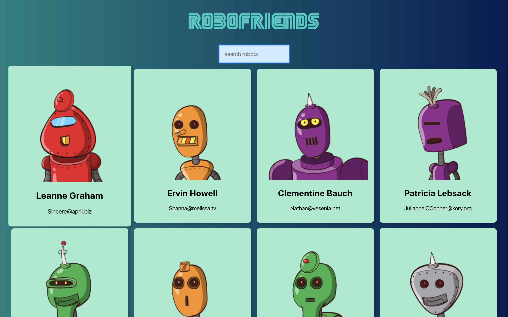

## A simple front end app which can generate robots charactors and search them.

Technologies used include React, Redux, HTML5/CSS3, TypeScript, tachyons.

[See this app live!](https://quanweihao.github.io/robofriends/)

